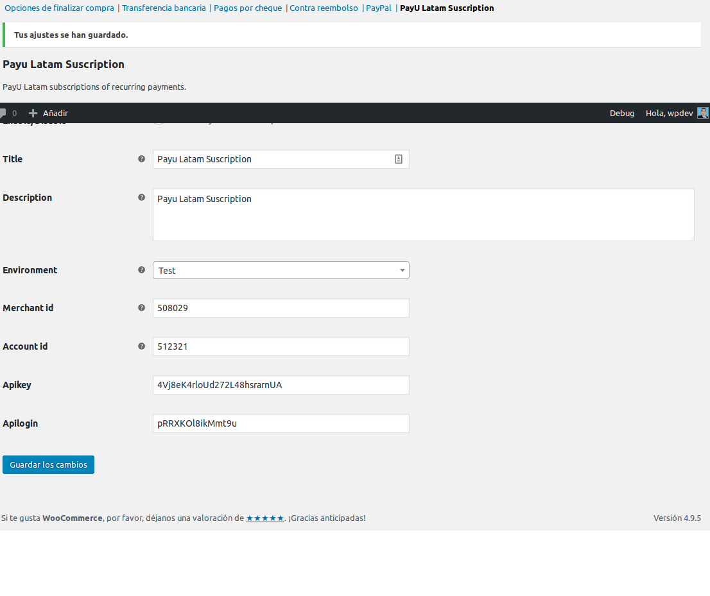
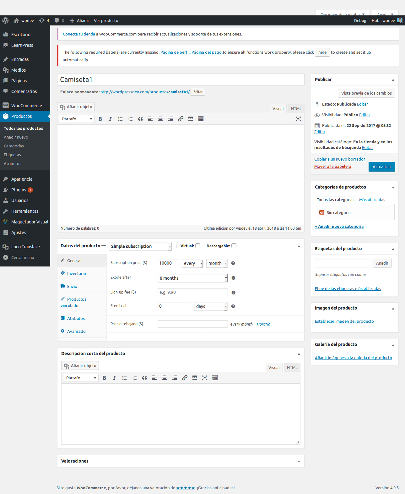

# Subscription Payu Latam #
**Contributors:**       Saul Morales Pacheco  
**Tags:**               commerce, e-commerce, commerce, wordpress ecommerce, store, sales, sell, shop, shopping, cart, checkout, configurable, payu, latam, subscription, Brasil, Colombia, México, Perú 

**Author URI:**         https://saulmoralespa.com  
**Plugin URI:**         https://wordpress.org/plugins/subscription-payu-latam/

**Requires at least:**  5.0  
**Tested up to:**       5.0

**Stable tag:**         1.0.17

**License:**            GPL-3.0+  
**License URI:**        http://www.gnu.org/licenses/gpl-3.0.html  

# Payu Latam Subscription

## Description ##
Subscription Payu Latam works together with the Woocommerce subscriptions plugin.
Receive recurring payments for the countries Brazil, Colombia, Mexico and Peru

**For any question or problem, get in contact [info@saulmoralespa.com](mailto:info@saulmoralespa.com)**

## Table of Contents

* [Requirements](#requirements)
* [Installation](#installation)
* [Frequent questions](#frequent-questions)

## Requirements ##

* Have installed WordPress and WooCommerce updated in version 3.0 or higher.
* Have the [Woocommerce Subscriptions](https://github.com/wp-premium/woocommerce-subscriptions) plugin installed and active
* PHP >= 5.6.0

## Installation ##

1. Download the plugin
2. Enter the administrator of your WordPress.
3. Enter Plugins / Add-New / Upload-Plugin.
4. Find the plugin downloaded on your computer and upload it like any other file.
5. After installing the .zip you can see it in the list of installed plugins, you can activate or deactivate it.
6. To configure the plugin you must go to: WooCommerce / Adjustments / Finish Purchase and Locate the tab Payu Latam Subscription.
7. Configure the plugin by entering Merchant id, Account id, Apikey, Apilogin provided by payu
8. Save Changes, if you have not done the configuration correctly you will be shown a warning, pay attention to this.
9. *Remember* you must ensure that the payment processing with the SDK is active

## Frequent questions ##

### Countries in which its use is available? ###

Brazil, Colombia, Mexico and Peru

### Are you required to use a ssl certificate? ###

No. But it is advisable that you consider using it since it is revealing for browsers

### How do I prove its operation? ###

You must go to the Woocommerce settings / finalize purchase / Payu Latam Subscription and change the testing environment.

**Remember to try in the testing environment with the credentials offered by payU latam** [see credentials](http://developers.payulatam.com/es/sdk/sandbox.html "test credentials")

### What should I take into account for production? ###

**Have the activation of the SDK**

###  ¿ What else should I keep in mind, that you have not told me ? ###

1. You need to use the [Woocommerce subscriptions](https://github.com/wp-premium/woocommerce-subscriptions)
2. You must set the number of decimals to zero, see screenshots.
3. PayU does not allow Sign-up fee, see screenshots.
4. **To perform tests you must use the credentials provided by payU** [see credentials](http://developers.payulatam.com/es/sdk/sandbox.html) and [fake credit card](https://es.fakenamegenerator.com/)
 

## Screenshots ## 

### 1. Half payment configuration ###

### 1. Half payment configuration corresponds ###

### 2. Change to zero decimals corresponds ###

### 3. Sign-up fee empty corresponds ###
